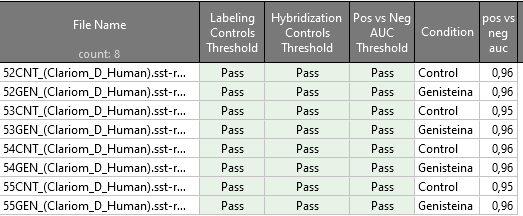

```{r configuracion inicial, include=FALSE}
# Establecemos la configuración de los chunks
knitr::opts_chunk$set(echo = TRUE,
                      message = TRUE,
                      warning = FALSE,
                      tidy = F)

# Establecemos el directorio de trabajo de este informe
# knitr::opts_knit$set(root.dir = "C:/Users/Adam_/Desktop/microvesiculas - copia para trabajar/Resultados ClariomD_Human")


set.seed(1)
##################################################
#######        Encoded in UTF-8        ###########
##################################################
```

***

# Introducción

En este documento se muestra cómo analizar los archivos con extensión `.CEL` resultantes de secuenciar muestras biológicas en los microchips _Clariom D Human_ de Affymetrix. Llevaremos a cabo este análisis en R 3.6 con el paquete de Bioconductor `oligo` versión 1.50.0. La versión de Biocondcutor empleada es la 3.10.


Fuente: https://wiki.bits.vib.be/index.php/Analyze_your_own_microarray_data_in_R/Bioconductor

y

https://www.thermofisher.com/es/es/home/life-science/microarray-analysis/microarray-data-analysis.html


<br>

***

# Carga de datos y librerías

Primero debemos instalar `oligo`. Téngase en cuenta que en R 3.6 se instala la versión 1.50.0 de `oligo`, el cual depende de los paquetes `ff` versión 2.2.14 y `RSQLite` versión 2.1.4. Instalar versiones posteriores ocasionará fallos en la carga de `oligo` y en los análisis posteriores:

```{r instalacion oligo y dependencias, eval = F}
# Instalación oligo en R 3.6:
BiocManager::install("oligo")

# Paquete ff versión 2.2.0: (en el portatil la 2.2.14 funciona, en el sobremesa no)
install.packages("https://cran.r-project.org/src/contrib/Archive/ff/ff_2.2-0.tar.gz", 
                 repos=NULL, type = "source")

# Paquete RSQLite versión 2.1.4:
install.packages("https://cran.r-project.org/src/contrib/Archive/RSQLite/RSQLite_2.1.4.tar.gz",
                 repos=NULL, type = "source")
```


<br>

Comenzamos cargando `oligo` y paquetes accesorios:

```{r carga librerias, message = F}
# Cargamos librerías
library("oligo")
library("ggplot2")
library("dplyr") 
library("FactoMineR") # PCA
library("rgl") # gráficos 3D
library("Rtsne") # t-SNE
```

<br>

Acto seguido definimos el directorio de trabajo en la carpeta donde se encuentran los archivos de secuenciado.

```{r}
directorio_trabajo <- "./Archivos secuenciado/"
```


Listamos y cargamos los archivos de secuenciado en el objeto de tipo `HTAFeatureSet` denominado `datos_crudos_microarrays`. La carga de los archivos `.CEL` se hace mediante la función `read.celfiles`, la cual lee y carga los archivos por orden alfabético de sus nombres (_i.e._ primero carga el archivo `52CNT_(Clariom_D_Human).CEL`, luego `52GEN_(Clariom_D_Human).CEL`, luego `53CNT_(Clariom_D_Human).CEL`, ...etc):

```{r}
# Obtenemos la ruta completa de los archivos con el argumento `full.names = T`
ruta_completa_archivos_secuenciado <- list.files(path = directorio_trabajo, pattern = "*.CEL", full.names = T)

# Cargamos datos
datos_crudos_microarrays <- read.celfiles(filenames = ruta_completa_archivos_secuenciado)

# Observamos el tipo de objeto que hemos cargado
summary(datos_crudos_microarrays)

# Observamos las sondas y muestras que tenemos
dim(datos_crudos_microarrays)
```

```{r, echo = F, eval = F}
# Con el comando str() podemos ver la estructura general y bolsillos del objeto
# `datos_crudos_microarrays`, pero no lo ejecutaremos para no llenar de
# información la terminal:
str(datos_crudos_microarrays)
```


Podemos ver el nombre de los microchips con el comando `sampleNames()`.

```{r}
sampleNames(datos_crudos_microarrays)
```

Vamos a cambiar sus nombres por otros más claros:

```{r}
sampleNames(datos_crudos_microarrays) <- c("Control_1", "Genisteina_1",
                                           "Control_2", "Genisteina_2",
                                           "Control_3", "Genisteina_3",
                                           "Control_4", "Genisteina_4")
sampleNames(datos_crudos_microarrays)
```

<br>

Al cargar los archivos `.CEL` con `read.celfiles()`, se almacena en el bolsillo `datos_crudos_microarrays@assayData$exprs` la matriz de intensidades crudas de los fluoróforos Cy3 y Cy5 que hibridan con las distintas sondas de cada microarray. Esta matriz tiene tantas filas como sondas tiene el microarray, y tantas columnas como muestras hayamos secuenciado. Las funciones `exprs()` e `intensity()` del paquete `oligo` simplifican el acceso a la misma (ambas funciones devuelven exactamente el mismo _output_).

* Las filas corresponden a cada sonda individual del microarray, identificada por un nº que va desde el 1 hasta el nº máximo de sondas presentes en el mismo (en el caso de los microarrays _Clariom D Human_, estos contienen un máximo de 6.892.960 sondas).

* Las columnas son las muestras, en nuestro caso `Control_1`, `Genisteina_1`, `Control_2`... etc

```{r}
# Obtenemos la matriz de intensidades cruda
intensidades <- oligo::exprs(datos_crudos_microarrays)

# Identificamos el nº de sondas presentes en cada microchip
dim(intensidades)[1]
```


<br>

De acuerdo a la documentación de [Affymetrix](https://www.affymetrix.com/support/help/exon_glossary/index.jsp#clusteroverview), las sondas de los microarrays de tipo Clariom D Human (Gene Arrays) están agrupadas en _transcription clusters_ en vez de _probesets_.

Con el comando `probeNames()` obtenemos los _transcription clusters_ a los que pertenecen las sondas de nuestro microchip, de manera que la primera sonda del microarray pertenece al _transcription cluster_ TC1300007722.hg.1: 

```{r}
# Obtenemos y mostramos los transcription clusters a los que pertenece cada sonda
transcription_clusters <- probeNames(datos_crudos_microarrays)
head(transcription_clusters)

# Cada microarray de tipo Clariom D Human contiene 1.220.891 transcription
# clusters
length(transcription_clusters)

# Obtenemos las sondas que pertenecen al transcription cluster TC1300007722.hg.1
which(transcription_clusters == "TC1300007722.hg.1")
```

<br>

Si tenemos cuenta en la página web de ThermoFisher, podemos usar el centro de análisis NetAffx para obtener más información sobre dichos clusters. Por ejemplo, si nos fijamos en el segundo _transcription cluster_, [TC0300011139.hg.1](https://www.affymetrix.com/analysis/netaffx/exon/hta_transcript.affx?pk=778:TC0300011139.hg.1), vemos que las sondas de este cluster detectan la presencia/ausencia de expresión del pseudogen RNA5SP132 (identificador [Ensembl:ENSG00000201595](http://www.ensembl.org/Homo_sapiens/Gene/Summary?g=ENSG00000201595;r=3:51694465-51694582;t=ENST00000364725)). 


```{r, echo = F, eval = F}
which(transcription_clusters == "TC1300007722.hg.1") # Devuelve 6 de 6 sondas

which(transcription_clusters == "TC0300011139.hg.1") # Devuelve 10 de 12 sondas

which(transcription_clusters == "TC1600006939.hg.1") # Devuelve 6 de 8 sondas

which(transcription_clusters == "TC0100018028.hg.1") # Devuelve 10 de 12 sondas

which(transcription_clusters == "TC0500010071.hg.1") # Devuelve 10 de 12 sondas

which(transcription_clusters == "TC1900010290.hg.1") # Devuelve 10 de 16 sondas
```


<br>

Además, el paquete `Biobase` incluye también numerosas funciones que se pueden ejecutar sobre los objetos de tipo `HTAFeatureSet` para obtener informacion contenida en el mismo, tales como abstracts, anotaciones, ...etc.

```{r}
# Anotación usada para nuestro objeto `HTAFeatureSet`
Biobase::annotation(datos_crudos_microarrays)

# Acceder a los datos del experimento del objeto `HTAFeatureSet` (en nuestro
# caso no está anotado)
Biobase::experimentData(datos_crudos_microarrays)
```


<br>

En relación a lo dicho en el párrafo anterior, las gráficas que generemos a lo largo del protocolo de análisis pueden usar información ubicada en el bolsillo `datos_crudos_microarrays@phenoData@data`, por lo que podemos añadir metadatos de interés con el comando `pData()` de `Biobase` tal que así:

```{r}
# Renombramos la columna "index" a "muestra"
colnames(pData(datos_crudos_microarrays)) <- "muestra"

# Añadimos el factor "Condición" a los metadatos de nuestro estudio
pData(datos_crudos_microarrays)$condicion <- as.factor(rep(c("Control", "Genisteina"), times = 4))

# Visualizamos los metadatos
pData(datos_crudos_microarrays)
```

<br>

***


# Métricas de calidad

## Efecto lote

Para analizar el efecto lote, podemos usar las fechas en las que se secuenciaron los microarrays. El comando `get.celfile.dates()` del paquete `affyio` devuelve la fecha de dicho proceso.

```{r}
affyio::get.celfile.dates(ruta_completa_archivos_secuenciado)
```
Vemos que los microarrays se secuenciaron el mismo día. Adicionalmente, el programa `GeneChip Command Console 6.0` de ThermoFisher (compañía propietaria de Affymetrix) aportó la hora del secuenciado, el cual duró 6 horas en total (11AM-5PM).

En vista de que el secuenciado se realizó en un sólo lote (el mismo día y en horas consecutivas), concluimos que la probabilidad de observar varianza debida al ruido técnico del efecto lote es mínima.


<br>

## Análisis QC

El programa `TAC 4.0.2`, propiedad también de ThermoFisher, muestra un resumen muy claro de las métricas de calidad de los microarrays.



Según la documentación del programa, un valor de `pos vs neg auc` > 0.7 es un buen primer cribado de calidad. Además de presentar un AUC > 0.7, el resto de controles han salido bien, por lo que podemos confiar en la calidad del secuenciado de los presentes microarrays.


En R, el paquete `oligo` parece no poder sacar dichas métricas en microarrays de tipo _Clariom_, puesto que al ser nuevos, no llevan asociados archivos `.CDF`. Quizás `limma` o `DESeq2` puedan tratar dichos microchips.


<br>

***

# Preprocesado de los microarrays: RMA


Antes de analizar los microarrays, necesitamos preprocesar las señales de las sondas para corregir el ruido técnico (problema común en los microarrays) y agrupar la información de las sondas que mapeen para un mismo gen (_summarization_).

Para preprocesar y normalizar datos de microarrays, se suelen emplear el algoritmo `RMA` o derivados (_i.e._ `GCRMA` o `SST-RMA`). En nuestro caso vamos a usar el algoritmo `RMA`, implementado en `oligo`. Este algoritmo consta de 3 pasos:

* __Background subtraction__. De acuerdo a la [documentación](http://bioconductor.org/packages/release/bioc/vignettes/oligo/inst/doc/oug.pdf) de `oligo`, el método de _background substraction_ implementado en RMA trata las sondas PM (_Perfect Match_, más informacion en [Flight _et al._](http://rmflight.github.io/affyMM/)) como una convolución de ruido y señal verdadera.

* __Quantile normalization__. Paso necesario para dotar de igual valor a los genes estudiados, independientemente de su nivel de expresión constitutivo (este paso evita, por ejemplo, que genes expresados de manera constitutiva pero poco interesantes para el estudio estén sobrerrepresentados en análisis posteriores con respecto de genes más relevantes, pero de menor expresión basal como son los genes codificantes de factores de transcripcion). El método de normalizado implementado en `oligo` es `quantile`.

* __Summarization__. Pasamos de analizar intensidades de sondas a niveles de expresión de genes. `oligo` realiza este paso mediante el método `medianpolish`.


Para más información sobre la implementación de estos pasos en oligo, por favor consulte la documentación de los comandos `rma`, `backgroundCorrectionMethods()` y sucedáneos.


<br>

En `oligo`, el comando `rma` nos devuelve un objeto de tipo `ExpressionSet` (similar al objeto `datos_crudos_microarrays`) con los datos preprocesados en el bolsillo `eSet_normalizado@assayData$exprs`. Procedemos al RMA:

```{r}
eSet_normalizado <- oligo::rma(object = datos_crudos_microarrays,
                                 background = T, normalize = T)

head(eSet_normalizado@assayData$exprs)[,1:4]
```

<br>

## Comprobación del normalizado: Boxplots

Podemos comparar los datos antes y después del normalizado y control de ruido técnico. Observamos que las intensidades medianas y los cuartiles 25-75 son idénticos entre todos los microarrays tras el normalizado, cosa que no era cierta en los datos crudos:

```{r}
par(mfcol = c(1,2))

boxplot(datos_crudos_microarrays, "all", 
        main = "Antes", col = rainbow(8), 
        ylab = "intensidad sondas (log2)")

boxplot(eSet_normalizado, main = "Después",
        col = rainbow(8), ylab = "intensidad sondas (log2)")
```


<br>

***

# Análisis DEG


## Separación de las muestras: PCA y t-SNE

Con los datos ya normalizados, podemos graficar los microarrays estudiados en un espacio de dimensionalidad reducida. La separación de los microarrays en dicho espacio nos dará una idea general de si existen genes diferencialmente expresados entre las condiciones estudiadas.

Para el PCA, podemos usar las utilidades del paquete `FactoMineR` tal que así:

```{r}
# Creamos un dataframe de intensidades procesable por el PCA de 
# dimensiones instancias x variables
intensidades_normalizadas <- t(exprs(eSet_normalizado))
intensidades_normalizadas_df <- as.data.frame(intensidades_normalizadas)

# Añadimos al dataframe el factor "condicion"
intensidades_normalizadas_df$condicion <- pData(eSet_normalizado)$condicion

# Computamos las 3 primeras componentes principales
pca_microarrays <- PCA(intensidades_normalizadas_df, graph = F, 
                       axes = c(1:3), quali.sup = 138746)

# Graficamos las 2 primeras componentes principales
plot.PCA(pca_microarrays, choix = "ind", habillage = 138746)
```


```{r, eval = F}
# Graficamos las 3 primeras componentes principales
plot3d(pca_microarrays$ind$coord[,1:3], type = "s", 
       col = c(rep(c("black", "red"), times = 4)))
```


<br>

<br>

y para el t-SNE:

```{r}
normalizado_tsne <- normalize_input(intensidades_normalizadas)
tsne_microarrays <- Rtsne(normalizado_tsne, dims = 3, perplexity = 2)

# Leyenda: Control negro, Genisteína rojo
plot(tsne_microarrays$Y, col = c("black", "red"))
```

```{r, eval = F}
plot3d(tsne_microarrays$Y[,1:3], type = "s", 
       col = c(rep(c("black", "red"), times = 4)))
```


<br>

<br>

y el UMAP:

```{r}
library("uwot")
umap_microarrays <- uwot::umap(intensidades_normalizadas, n_neighbors = 3, 
                               n_components = 3)

# Leyenda: Control negro, Genisteína rojo
plot(umap_microarrays, col = c("black", "red"))
```

```{r, eval = F}
# Graficamos el UMAP en 3D
plot3d(umap_microarrays, type = "s", 
       col = c(rep(c("black", "red"), times = 4)))

```


<br>

## Análisis cualitativo: MA Plots

Para visualizar si hay genes diferencialmente expresados, podemos emplear el comando `MAplot` del paquete `oligo`. Los gráficos MA muestran en el eje X la intensidad media de una sonda dada a lo largo de los microarrays estudiados, y en el eje Y se observa el log2(fold change) o logaritmo en base dos del ratio de sobre/infraexpresión del gen al que mapea dicha sonda. 

Los genes diferencialmente expresados se encontrarán lejos de la nube de puntos (log2(FC) > |1|), mientras que los genes que no varíen entre condiciones presentarán valores de log2(FC) cercano a 0.

```{r}
par(mfrow=c(2,2))

oligo::MAplot(eSet_normalizado, refSamples = c(1,3,5,7), which = c(2,4,6,8), main = "vs grupo Control")
```


<br>

***

# SECCIÓN EXPERIMENTAL!!!!!!!!


## Diagramas Venn


https://www.datanovia.com/en/blog/venn-diagram-with-r-or-rstudio-a-million-ways/
paquetes ggvenn o ggVennDiagram

***

<br>


# Bibliografía

* PlaceHolder


***

<br>


# sessionInfo()

```{r, echo = F}
sessionInfo()
```
