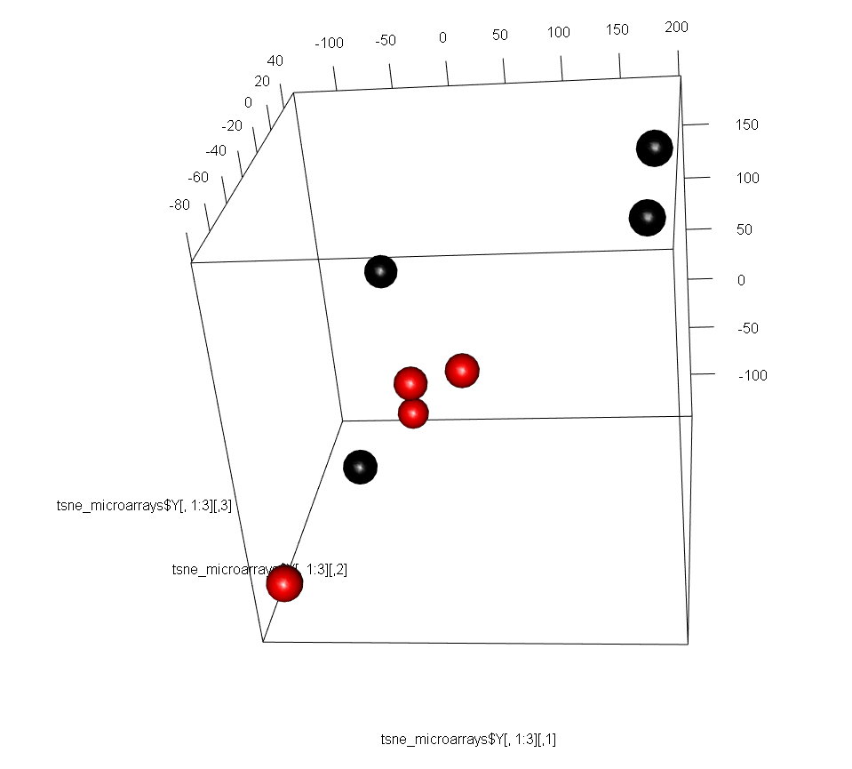
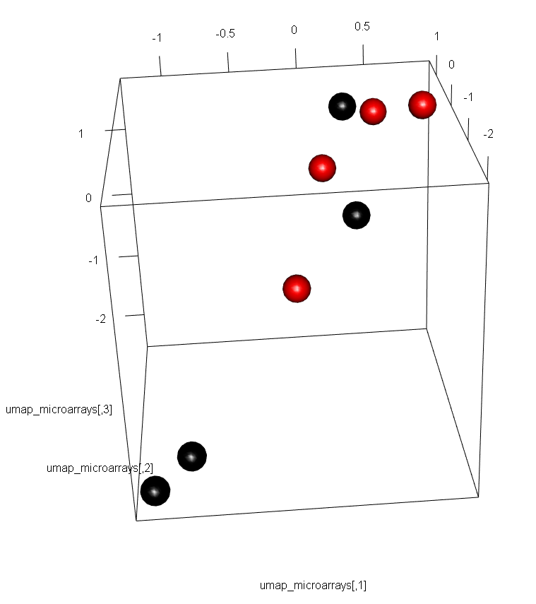

```{r configuracion inicial, include=FALSE}
##################################################
#######        Encoded in UTF-8        ###########
##################################################

# Establecemos la configuración de los chunks
knitr::opts_chunk$set(echo = T,
                      message = F,
                      warning = F,
                      tidy = F)
set.seed(1)
```

***

# Introducción

En este documento se muestra cómo analizar los archivos con extensión `.CEL` resultantes de secuenciar muestras biológicas en los microchips _Clariom D Human_ de Affymetrix. Llevaremos a cabo este análisis en R 3.6 con el paquete de Bioconductor `oligo` versión 1.50.0. La versión de Biocondcutor empleada es la 3.10.


<br>

***

# Carga de librerías y datos

Primero debemos instalar `oligo`. Téngase en cuenta que en R 3.6 se instala la versión 1.50.0 de `oligo`, el cual depende de los paquetes `ff` versión 2.2.0 y `RSQLite` versión 2.1.4. Instalar versiones posteriores ocasionará fallos en la carga de `oligo` y en los análisis posteriores:

```{r instalacion oligo y dependencias, eval = F}
# Instalación oligo en R 3.6:
BiocManager::install("oligo")

# Paquete ff versión 2.2.0: (en el portatil la 2.2.14 funciona, en el sobremesa no)
# remove.packages("ff")
install.packages(
  "https://cran.r-project.org/src/contrib/Archive/ff/ff_2.2-0.tar.gz",
  repos=NULL, 
  type = "source")

# Paquete RSQLite versión 2.1.4:
install.packages(
  "https://cran.r-project.org/src/contrib/Archive/RSQLite/RSQLite_2.1.4.tar.gz",
  repos=NULL, 
  type = "source")
```


<br>

Comenzamos cargando `oligo` y paquetes accesorios:

```{r carga librerias}
library("oligo") # Data import, pre-processing, and QC 
library("limma") # DEG Analysis
library("ggplot2") # Plots
library("rgl") # 3D plots
library("dplyr")  # Data wrangling
library("FactoMineR") # PCA
library("Rtsne") # t-SNE
library("uwot") # UMAP
```

<br>

Acto seguido definimos el directorio de trabajo en la carpeta donde se encuentran los archivos de secuenciado.

```{r}
directorio_trabajo <- "../Archivos secuenciado/"
```


Listamos y cargamos los archivos de secuenciado en el objeto de tipo `HTAFeatureSet` denominado `datos_crudos_microarrays`. La carga de los archivos `.CEL` se hace mediante la función `read.celfiles`, la cual lee y carga los archivos por orden alfabético de sus nombres (_i.e._ primero carga el archivo `52CNT_(Clariom_D_Human).CEL`, luego `52GEN_(Clariom_D_Human).CEL`, luego `53CNT_(Clariom_D_Human).CEL`, ...etc):

```{r}
# Obtenemos la ruta completa de los archivos con el argumento `full.names = T`
ruta_completa_archivos_secuenciado <- list.files(path = directorio_trabajo, pattern = "*.CEL", full.names = T)

# Cargamos datos
datos_crudos_microarrays <- read.celfiles(filenames = ruta_completa_archivos_secuenciado)

# Observamos el tipo de objeto que hemos cargado
summary(datos_crudos_microarrays)

# Observamos las sondas y muestras que tenemos
dim(datos_crudos_microarrays)
```

```{r, echo = F, eval = F}
# Con el comando str() podemos ver la estructura general y bolsillos del objeto
# `datos_crudos_microarrays`, pero no lo ejecutaremos para no llenar de
# información la terminal:
str(datos_crudos_microarrays)
```


Podemos ver el nombre de los microchips con el comando `sampleNames()`.

```{r}
sampleNames(datos_crudos_microarrays)
```

Vamos a cambiar sus nombres por otros más claros:

```{r}
sampleNames(datos_crudos_microarrays) <- c("Control_1", "Genisteina_1",
                                           "Control_2", "Genisteina_2",
                                           "Control_3", "Genisteina_3",
                                           "Control_4", "Genisteina_4")
sampleNames(datos_crudos_microarrays)
```

<br>

Al cargar los archivos `.CEL` con `read.celfiles()`, se almacena en el bolsillo `datos_crudos_microarrays@assayData$exprs` la matriz de intensidades crudas de los fluoróforos Cy3 y Cy5 que hibridan con las distintas sondas de cada microarray. Esta matriz tiene tantas filas como sondas tiene el microarray, y tantas columnas como muestras hayamos secuenciado. Las funciones `exprs()` e `intensity()` del paquete `oligo` simplifican el acceso a la misma (ambas funciones devuelven exactamente el mismo _output_).

* Las filas corresponden a cada sonda individual del microarray, identificada por un nº que va desde el 1 hasta el nº máximo de sondas presentes en el mismo (en el caso de los microarrays _Clariom D Human_, estos contienen un máximo de 6.892.960 sondas).

* Las columnas son las muestras, en nuestro caso `Control_1`, `Genisteina_1`, `Control_2`... etc

```{r}
# Obtenemos la matriz de intensidades cruda
intensidades <- oligo::exprs(datos_crudos_microarrays)

# Identificamos el nº de sondas presentes en cada microchip
dim(intensidades)[1]
```


<br>

De acuerdo a la documentación de [Affymetrix](https://www.affymetrix.com/support/help/exon_glossary/index.jsp#clusteroverview), las sondas de los microarrays de tipo Clariom D Human (Gene Arrays) están agrupadas en _transcription clusters_ en vez de _probesets_.

Con el comando `probeNames()` obtenemos los _transcription clusters_ a los que pertenecen las sondas de nuestro microchip, de manera que la primera sonda del microarray pertenece al _transcription cluster_ TC1300007722.hg.1: 

```{r}
# Obtenemos y mostramos los transcription clusters a los que pertenece cada sonda
transcription_clusters <- probeNames(datos_crudos_microarrays)
head(transcription_clusters)

# Cada microarray de tipo Clariom D Human contiene 1.220.891 transcription
# clusters
length(transcription_clusters)

# Obtenemos las sondas que pertenecen al transcription cluster TC1300007722.hg.1
which(transcription_clusters == "TC1300007722.hg.1")
```

<br>

Si tenemos en cuenta la página web de ThermoFisher, podemos usar el centro de análisis NetAffx para obtener más información sobre dichos clusters. Por ejemplo, si nos fijamos en el segundo _transcription cluster_, [TC0300011139.hg.1](https://www.affymetrix.com/analysis/netaffx/exon/hta_transcript.affx?pk=778:TC0300011139.hg.1), vemos que las sondas de este cluster detectan la presencia/ausencia de expresión del pseudogen RNA5SP132 (identificador [Ensembl:ENSG00000201595](http://www.ensembl.org/Homo_sapiens/Gene/Summary?g=ENSG00000201595;r=3:51694465-51694582;t=ENST00000364725)). 


```{r, echo = F, eval = F}
which(transcription_clusters == "TC1300007722.hg.1") # Devuelve 6 de 6 sondas

which(transcription_clusters == "TC0300011139.hg.1") # Devuelve 10 de 12 sondas

which(transcription_clusters == "TC1600006939.hg.1") # Devuelve 6 de 8 sondas

which(transcription_clusters == "TC0100018028.hg.1") # Devuelve 10 de 12 sondas

which(transcription_clusters == "TC0500010071.hg.1") # Devuelve 10 de 12 sondas

which(transcription_clusters == "TC1900010290.hg.1") # Devuelve 10 de 16 sondas
```


<br>

Además, el paquete `Biobase` incluye también numerosas funciones que se pueden ejecutar sobre los objetos de tipo `HTAFeatureSet` para obtener informacion contenida en el mismo, tales como abstracts, anotaciones, ...etc.

```{r}
# Anotación usada para nuestro objeto `HTAFeatureSet`
Biobase::annotation(datos_crudos_microarrays)

# Acceder a los datos del experimento del objeto `HTAFeatureSet` (en nuestro
# caso no está anotado)
Biobase::experimentData(datos_crudos_microarrays)
```


<br>

En relación a lo dicho en el párrafo anterior, las gráficas que generemos a lo largo del protocolo de análisis pueden usar información ubicada en el bolsillo `datos_crudos_microarrays@phenoData@data`, por lo que podemos añadir metadatos de interés con el comando `pData()` de `Biobase` tal que así:

```{r}
# Renombramos la columna "index" a "muestra"
colnames(pData(datos_crudos_microarrays)) <- "muestra"

# Añadimos el factor "Condición" a los metadatos de nuestro estudio
pData(datos_crudos_microarrays)$condicion <- as.factor(rep(c("Control", "Genisteina"), times = 4))

# Visualizamos los metadatos
pData(datos_crudos_microarrays)
```

<br>

***


# Métricas de calidad

## Efecto lote

Para analizar el efecto lote, podemos usar las fechas en las que se secuenciaron los microarrays. El comando `get.celfile.dates()` del paquete `affyio` devuelve la fecha de dicho proceso.

```{r}
affyio::get.celfile.dates(ruta_completa_archivos_secuenciado)
```
Vemos que los microarrays se secuenciaron el mismo día. Adicionalmente, el programa `GeneChip Command Console 6.0` de ThermoFisher (compañía propietaria de Affymetrix) aportó la hora del secuenciado, el cual duró 6 horas en total (11AM-5PM).

En vista de que el secuenciado se realizó en un sólo lote (el mismo día y en horas consecutivas), concluimos que la probabilidad de observar varianza debida al ruido técnico del efecto lote es mínima.


<br>

## Análisis QC

El programa `TAC 4.0.2`, propiedad también de ThermoFisher, muestra un resumen muy claro de las métricas de calidad de los microarrays.


Según la documentación del programa, un valor de `pos vs neg auc` > 0.7 es un buen primer cribado de calidad. Además de presentar un AUC > 0.7, el resto de controles han salido bien, por lo que podemos confiar en la calidad del secuenciado de los presentes microarrays.


En R, el paquete `oligo` parece no poder sacar dichas métricas en microarrays de tipo _Clariom_, puesto que al ser nuevos, no llevan asociados archivos `.CDF`. Quizás `limma` o `DESeq2` puedan tratar dichos microchips.


<br>

***

# Preprocesado de los microarrays: RMA


Antes de analizar los microarrays, necesitamos preprocesar las señales de las sondas para corregir el ruido técnico (problema común en los microarrays) y agrupar la información de las sondas que mapeen para un mismo gen (_summarization_).

Para preprocesar y normalizar datos de microarrays, se suelen emplear el algoritmo `RMA` o derivados (_i.e._ `GCRMA` o `SST-RMA`). En nuestro caso vamos a usar el algoritmo `RMA`, implementado en `oligo`. Este algoritmo consta de 3 pasos:

* __Background subtraction__. De acuerdo a la [documentación](http://bioconductor.org/packages/release/bioc/vignettes/oligo/inst/doc/oug.pdf) de `oligo`, el método de _background substraction_ implementado en RMA trata las sondas PM (_Perfect Match_, más informacion en [Flight _et al._, 2012](http://rmflight.github.io/affyMM/)) como una convolución de ruido y señal verdadera.

* __Quantile normalization__. Paso necesario para dotar de igual valor a los genes estudiados, independientemente de su nivel de expresión constitutivo (este paso evita, por ejemplo, que genes expresados de manera constitutiva pero poco interesantes para el estudio estén sobrerrepresentados en análisis posteriores con respecto de genes más relevantes, pero de menor expresión basal como son los genes codificantes de factores de transcripcion). El método de normalizado implementado en `oligo` es `quantile`.

* __Summarization__. Pasamos de analizar intensidades de sondas a niveles de expresión de genes. `oligo` realiza este paso mediante el método `medianpolish`.


Para más información sobre la implementación de estos pasos en oligo, por favor consulte la documentación de los comandos `rma`, `backgroundCorrectionMethods()` y sucedáneos.


<br>

En `oligo`, el comando `rma` nos devuelve un objeto de tipo `ExpressionSet` (similar al objeto `datos_crudos_microarrays`) con los datos preprocesados en el bolsillo `eSet_normalizado@assayData$exprs`. Procedemos al RMA:

```{r}
eSet_normalizado <- oligo::rma(object = datos_crudos_microarrays,
                                 background = T, normalize = T)

head(eSet_normalizado@assayData$exprs)[,1:4]
```


<br>

Comentar que hemos guardado los genes con los nombres de los _transcription clusters_. Si queremos saber el nombre oficial de los genes (en caso de que lo tengan), debemos traducirlos mediante el ya mencionado portal NetAffx, o bien consultando el archivo accesorio `Anotaciones Genes NetAffx.tsv`, o bien automáticamente con el comando `annotateEset()` del paquete `affycoretools`:

```{r}
library("affycoretools")
library("clariomdhumantranscriptcluster.db")
eSet_normalizado <- annotateEset(
  eSet_normalizado, 
  clariomdhumantranscriptcluster.db, 
  multivals = "first",
  columns = c("ENTREZID", "SYMBOL", "GENENAME", "ENSEMBL", "REFSEQ", "ACCNUM",
              "ALIAS", "GENETYPE", "GO", "GOALL", "ONTOLOGY", "ONTOLOGYALL",
              "PATH", "PROBEID")) 
```

```{r, echo = F, eval = F}
# Puedes usar como paquete de anotación tanto la librería `pd.clariom.d.human`
# como `clariomdhumantranscriptcluster.db`. Cada una tiene unas anotaciones que
# la otra no contiene. Lo mejor es generar dos tablas, una para cada librería, y
# cruzar los resultados

# Para ver los tipos de anotaciones disponibles en
# `clariomdhumantranscriptcluster.db``, usa:
#
# columns(clariomdhumantranscriptcluster.db)

# El método `columns()` no está disponible para el paquete `pd.clariom.d.human`
```


<br>

## Comprobación del normalizado: Boxplots y gráficos de densidad


Para poder analizar y comparar las muestras, es necesario que estén normalizadas. El hecho de que sus medianas estén centradas es un claro indicador de que el normalizado ha sido exitoso. Podemos comparar los datos antes y después del normalizado y control del ruido técnico. Observamos que las intensidades medianas y los cuartiles 25-75 son idénticos entre todos los microarrays tras el normalizado, cosa que no era cierta en los datos crudos:

```{r}
par(mfcol = c(1,2))

boxplot(datos_crudos_microarrays, "all", 
        main = "Antes", col = rainbow(8), 
        ylab = "intensidad sondas (log2)")

boxplot(eSet_normalizado, main = "Después",
        col = rainbow(8), ylab = "intensidad sondas (log2)")
```

```{r, eval = F, echo = F}
# Comparación por grupos en vez de por muestras.
boxplot(formula = intensidades_normalizadas ~ eSet_normalizado$condicion, 
        main = "Después", ylab = "intensidad sondas (log2)",
        xlab = "", col = rainbow(2))
```


<br>

Otra manera de visualizar la información contenida en los boxplots es graficar la distribución de las intensidades en un gráfico de densidad. Este gráfico es el equivalente a observar los boxplots desde un lateral, y al igual que en el boxplot, para poder comparar las muestras es necesario que sus curvas de densidad sean similares:

```{r}
plotDensities(exprs(eSet_normalizado), legend = "topright", 
              group = eSet_normalizado$condicion, col = rainbow(2),
              main = "Expression density")
```


<br>

***

# Análisis DEG

De acuerdo a la revisión de [McDermaid _et al._(2019)](https://www.ncbi.nlm.nih.gov/pmc/articles/PMC6954399/), los paquetes más populares para el análisis DEG son `limma`, `edgeR`, `Cutdiff/Cutdiff2`, y `DESeq2`. En este informe nos centraremos en `limma` y en futuros informes exploraremos el uso de los otros paquetes.

<br>


## Separación de las muestras: PCA, t-SNE y UMAP

Con los datos ya normalizados, podemos graficar los microarrays estudiados en un espacio de dimensionalidad reducida. La separación de los microarrays en dicho espacio nos dará una idea general de si existen genes diferencialmente expresados entre las condiciones estudiadas.

Para el PCA, podemos usar las utilidades del paquete `FactoMineR` tal que así:

```{r}
# Creamos un dataframe de intensidades procesable por el PCA de 
# dimensiones instancias x variables
intensidades_normalizadas <- t(exprs(eSet_normalizado))
intensidades_normalizadas_df <- as.data.frame(intensidades_normalizadas)

# Añadimos al dataframe el factor "condicion"
intensidades_normalizadas_df$condicion <- pData(eSet_normalizado)$condicion

# Computamos las 3 primeras componentes principales
pca_microarrays <- PCA(intensidades_normalizadas_df, graph = F, 
                       axes = c(1:3), quali.sup = 138746)

# Graficamos las 2 primeras componentes principales
plot.PCA(pca_microarrays, choix = "ind", habillage = 138746)

# library(FactoInvestigate)
# FactoInvestigate::Investigate(pca_microarrays)
```

```{r, eval = F}
# Para otros análisis
saveRDS(intensidades_normalizadas_df, file = "intensidades_normalizadas_df.rds")
```


```{r, eval = F}
# Graficamos las 3 primeras componentes principales
plot3d(pca_microarrays$ind$coord[,1:3], type = "s", 
       col = c(rep(c("black", "red"), times = 4)))
```


<br>

<br>

y para el t-SNE:

```{r}
normalizado_tsne <- normalize_input(intensidades_normalizadas)
tsne_microarrays <- Rtsne(normalizado_tsne, dims = 3, perplexity = 2)

# Leyenda: Control negro, Genisteína rojo
plot(tsne_microarrays$Y, col = c("black", "red"), main = "t-SNE plot of individuals")
```

```{r, eval = F}
plot3d(tsne_microarrays$Y[,1:3], type = "s", 
       col = c(rep(c("black", "red"), times = 4)))
```



<br>

<br>

y el UMAP:

```{r}
umap_microarrays <- uwot::umap(intensidades_normalizadas, n_neighbors = 3, 
                               n_components = 3)

# Leyenda: Control negro, Genisteína rojo
plot(umap_microarrays, col = c("black", "red"), main = "UMAP plot of individuals")
```

```{r, eval = F}
# Graficamos el UMAP en 3D
plot3d(umap_microarrays, type = "s", 
       col = c(rep(c("black", "red"), times = 4)))
```




<br>


En resumen, el PCA de 2 dimensiones es la reducción dimensional más informativa de la posible distribución de las muestras. El t-SNE y el UMAP en 3D no son concluyentes (los datos parecen mezclarse).


<br>

## Análisis cualitativo: MA Plots

Para visualizar si hay genes diferencialmente expresados, podemos emplear el comando `MAplot` del paquete `oligo`. Los gráficos MA muestran en el eje X la intensidad media de una sonda dada a lo largo de los microarrays estudiados, y en el eje Y se observa el log<sub>2</sub>(fold change) o logaritmo en base dos del ratio de sobre/infraexpresión del gen al que mapea dicha sonda. 

Los genes diferencialmente expresados se encontrarán lejos de la nube de puntos (log<sub>2</sub>(FC) > |1|), mientras que los genes que no varíen entre condiciones presentarán valores de log<sub>2</sub>(FC) cercanos a 0. No obstante, el MA plot no devuelve p-valores, por lo que para asegurarnos de que los resultados son significativos, deberíamos recurrir a un Volcano plot, que combina el log<sub>2</sub>(FC) y los p-valores de los genes estudiados.

```{r}
par(mfrow=c(2,2))

oligo::MAplot(eSet_normalizado, refSamples = c(1,3,5,7), which = c(2,4,6,8), main = "vs grupo Control")
```


<br>


## `limma`: Análisis de 2 grupos de datos no pareados

Procedemos a detectar los genes diferencialmente expresados mediante las utilidades del paquete `limma`, ya que `oligo` carece de las funciones necesarias para ello. `limma` usa como _input_ el objeto que devuelve el comando `rma()`. 

Nuestros datos no son pareados, por lo que usaremos un t-test normal en lugar de uno para datos pareados (si comparásemos 3 grupos, usaríamos un ANOVA para medidas repetidas en lugar de un ANOVA de 1 vía).

`limma` contiene funciones para hacer t-tests o ANOVAs para identificar DEGs en microarrays. Estas funciones pueden ser usadas en datos provenientes de cualquier tipo de microarray y funcionan incluso para microarrays con diseños complejos o múltiples muestras. La idea principal es ajustar un modelo lineal a los datos de expresión de cada gen. Los datos de expresión pueden ser log-ratios o log-intensidades. Los métodos empleados obtienen información sobre todos los genes para hacer que los análisis sean estables incluso en experimentos con un bajo tamaño muestral.


Antes de nada tenemos que indicarle al susodicho paquete mediante el hueco `phenoData` a qué grupo (en este caso, factor `condicion`) pertenece cada muestra. Podemos ver que ya hemos hecho eso en pasos anteriores:

```{r}
pData(eSet_normalizado)
```


<br>

Ahora tenemos que crear una __matriz de diseño__, o sea una matriz con los niveles del factor que agrupa los datos. Los t-tests, ANOVAs y GLMs necesitan dicha matriz para saber qué muestras pertenecen a qué grupo. Puesto que `limma` usa un t-test o un ANOVA, necesita dicha matriz de diseño. puedes crearla con el método `model.matrix()`. Esta función toma como argumento un modelo de fórmula (_model formula_). La virgulilla (~) especifica el lado derecho de la fórmula. Si usas como fórmula ~0, `limma` calculará sólo la expresión génica media de cada grupo.

```{r}
# Creamos el diseño del t-test no pareado
matriz_diseno = model.matrix(~ 0 + eSet_normalizado$condicion)
colnames(matriz_diseno) <- c("Control","Genisteina")
```


<br>

En nuestra matriz de diseño podemos ver a qué grupo o nivel del factor pertenece cada muestra (columna de la izquierda del 1 al 6). Un 1 representa que la muestra pertenece a dicho grupo.

```{r, echo = F}
head(matriz_diseno)
```


<br>

En esencia, `limma` va a comparar, para cada gen, su expresión media en las muestras control y su expresión media en las muestras tratadas con genisteína. Lo primero, debemos calcular la expresión media de cada grupo usando el comando `lmFit()`. Este comando ajustará un modelo lineal (definido previamente con el comando `model.matrix()`) a los datos para calcular la expresión génica media en las muestras control y en las muestras tratadas:

```{r}
# Generamos el modelo lineal
modelo_lineal <- lmFit(t(intensidades_normalizadas), design = matriz_diseno)

# Vemos los bolsillos que posee el objeto `modelo_lineal`
names(modelo_lineal)
```


<br>

Podemos ver la expresión génica media de cada grupo en formato log<sub>2</sub> en el bolsillo `$coefficients` del modelo lineal:

```{r}
modelo_lineal$coefficients[5000:5005,]
```

<br>

Ahora debes indicarle al paquete qué grupos quieres comparar. Para ello debes definir una __matriz de contrastes__ en la cual se especifiquen las comparaciones a realizar mediante el comando `makeContrasts()`. Usando los nombres de las columnas de la matriz de diseño, puedes especificar el grupo control respecto al cual quieres comparar el grupo de interés (tratado con genisteína).

Téngase en cuenta que el orden en el que defines los grupos afecta a la interpretación de los resultados. Para comparaciones de 2 grupos, es conveniente definir primero el grupo de tratamiento y luego el grupo control, pues de esa manera el el log fold change se puede interpretar en base al grupo control. Así, genes con un log<sub>2</sub>FC positivo estarán sobreexpresados en el tratamiento respecto al control, y viceversa para los genes infraexpresados.

```{r}
# creamos matriz de contraste
matriz_contrastes <- makeContrasts(Genisteina - Control, levels = matriz_diseno)
```


<br>

La manera de interpretar una matriz de contrastes es, para cada contraste, si sale un -1 es el grupo control; si sale un 0 no actúa, y si sale un 1 es el grupo de tratamiento. A continuación mostramos nuestra matriz de contrastes: 

```{r}
matriz_contrastes
```


<br>

Ahora calculamos las comparaciones de interés con el comando `contrasts.fit()`. En este caso, calculamos la diferencia de la expresión de cada gen entre las muestras tratadas con genisteína y las muestras control. Nótese que el output del susodicho comando es similar al del comando `lmFit()`:

```{r}
diferencia_genisteina_control <- contrasts.fit(fit = modelo_lineal, 
                                               contrasts = matriz_contrastes)
```


<br>

Con las diferencias calculadas, estamos listos para realizar los tests estadísticos para comparar los grupos. Ya que compararemos dos grupos, usaremos un t-test para datos no pareados. No obstante, en el caso de los microarrays se debe usar un t-test moderado ya que al tener pocas muestras, aumenta la varianza de los datos y los resultados se vuelven poco fiables. El comando `eBayes()` estima la varianza media de todo el genoma y converge la varianza de cada gen hacia dicho valor global estimado (_i.e._ aumenta la varianza de genes poco variables y disminuye la varianza de genes muy variables). Este t-test moderado por el método de Bayes empírico es a consecuencia más potente que el t-test estándar para estudios de microarrays.

```{r}
t_test_bayes = eBayes(diferencia_genisteina_control, trend = T)
```


<br>

Tras realizar el test t de Student moderado, es conveniente analizar la relación entre la expresión media y la varianza de cada gen mediante un gráfico _Sigma vs A_. Este tipo de gráfico muestra si hay mucha varianza en los genes y si es necesario tener en cuenta la tendencia de la media-varianza de estos. Dicho con otras palabras, en caso de que haya mucha varianza en los datos, se le debe dar más peso a los microarrays/muestras que mejor se ajusten al modelo lineal que hemos generado con el comando `ebayes()`, y viceversa para aquellas muestras que se desvíen mucho de dicho modelo, pues ello mejorará la potencia estadística del test sin afectar al FDR. Para más información, consulte la información disponible sobre estos gráficos en el apartado _"Visualization"_ de la documentación de [GEO2R](https://www.ncbi.nlm.nih.gov/geo/info/geo2r.html#how_to_use) y el [capítulo 10](http://bioconductor.org/packages/2.6/bioc/vignettes/limma/inst/doc/usersguide.pdf) de la documentación oficial del paquete `limma`.

```{r}
# Sigma vs A plot for microarray linear model
plotSA(t_test_bayes, xlab = "Average log2-expression", 
       ylab = "log2(sigma)", pch = 16, cex = 0.2)
```

<br>

En el gráfico vemos marcada en azul la susodicha tendencia. Si la tendencia se asemejase a una línea horizontal, tendríamos que correr el test moderado con el comando `trend = F`, pues si la varianza es constante, nos estaría indicando que todos los arrays se ajustan por igual al modelo lineal entrenado y no sería necesario ajustar sus pesos. En nuestro caso lo dejaremos tal cual está debido a que vemos una ligera tendencia. Por último, mencionar que si graficamos el output del comando `arrayWeights()`, podemos visualizar la explicación del párrafo anterior:

```{r}
pesos <- arrayWeights(eSet_normalizado, design = matriz_diseno)
barplot(pesos, xlab = "Microarray", ylab = "Peso", col = "white", las = 2)
abline(h = 1, lty = 2)

# El objeto `pesos` se puede usar como input del parámetro `weights` del comando
# lmFit()
```

```{r, echo = F, eval = F}
# De acuerdo a su desarrollador Gordon Smyth en
# https://support.bioconductor.org/p/67590/ , vooma() está obsoleto. En su lugar
# usa voom(). Parece que voom() y vooma() son para RNA-Seq (y ChIP-Seq) con
# conteo de transcritos y no para microarrays de intensidades.

# Para microarrays, usa:
#
# fit <- lmFit(y, design)
# fit <- eBayes(fit, trend=TRUE)


# Para RNA-Seq con matrices de conteo, usa esto debido a la diferencia de
# profundidad de secuenciado de cada muestra/librería:
#
# v <- vooma(matriz_conteo_normalizada, matriz_disenno)
# fit <- lmFit(v, matriz_disenno)
# fit <- eBayes(fit)

# Nótese que puedes ahorrarte todo el tema de voom() y vooma() usando trend = T
# en eBayes()
vooma(exprs(eSet_normalizado), design = matriz_diseno, correlation, block=NULL, plot = T, span = NULL)

voomaByGroup(eSet_normalizado, group = eSet_normalizado$condicion, 
             design=matriz_diseno, correlation, block = NULL,
             plot = T, span = NULL, col = NULL, lwd = 1, alpha = 0.5,
             pch = 16, cex = 0.3, legend = "topright")
```

<br>

El comando `eBayes()` devuelve un dataframe con múltiples huecos, similar al output del comando `contrasts.fit()`. Nótese que a diferencia de `contrasts.fit()` (que sólo calcula la diferencia entre la expresión génica de los dos grupos), `eBayes()` calcula los p-valores de dichas diferencias: 

```{r}
names(t_test_bayes)
```


<br>

Puedes obtener el fold change en formato log<sub>2</sub> de la expresión de cada gen a través del hueco `$coefficients` del t-test moderado:

```{r}
# Log2FC de genes:
head(t_test_bayes$coefficients)
```


<br>

Puedes encontrar los valores del estadístico t y el p-valor de cada gen en sus respectivos huecos:

```{r}
head(t_test_bayes$p.value)
head(t_test_bayes$t)
```


```{r, qqplot, eval = F, echo = F}
# El eje X es la distribución de una t de student teórica, mientras que el eje Y
# es la distribución de nuestros datos. Si ambas coinciden (línea diagonal), los
# datos son normales (la t de student es normal al fin y al cabo, y estás
# comparándola contra tus datos).
qqt(y = t_test_bayes$t[,1], df= t_test_bayes$df.residual + t_test_bayes$df.prior); abline(0,1)
```

<br>

***

# Resultados análisis DEG

Tras realizar el t-test moderado, se grafican los resultados en un volcano plot. El volcano plot muestra en el eje X el log<sub>2</sub>FC entre dos grupos (_i.e._ impacto biológico del cambio) y en el eje Y mide el p-valor del cambio (_i.e._ la evidencia estadística de los resultados). En nuestro caso resaltaremos las regiones del gráfico cuyos genes tengan simultáneamente un p-valor < 0.05 y un FC > |2| (cuadrantes superiores derecho e izquierdo):

```{r}
volcanoplot(t_test_bayes, highlight = 0); abline(h = 1.301, v = c(-1,1), lty = 2)
```


Nótese que el parámetro `coef` del comando `volcanoplot()` te permite seleccionar la comparación a graficar (disponible en el bolsillo `t_test_bayes$coefficients`), pero en nuestro caso sólo hemos hecho una comparación (Genisteína vs Control), por lo que lo dejamos con su valor por defecto.


<br>

Tras analizar las regiones de interés del volcano plot, vemos que hay genes candidatos a estar diferencialmente expresados. Vamos a reunir todos los genes detectados en los microarrays en un dataframe y ordenarlos en función de su p-valor no ajustado mediante el comando `topTable`: 

```{r}
df_DEG = topTable(t_test_bayes ,coef = 1 ,number = 138745, adjust.method ="BH", sort.by = "p")
head(df_DEG)
```


<br>

Ahora procedemos a seleccionar sólo los genes que caen en los cuadrantes de interés del volcano plot (p-valor no ajustado < 0.05 y log<sub>2</sub>FC > |1|) y los guardamos en el dataframe `DEG_limma`: 

```{r}
genes_diferencialmente_expresados <- which(df_DEG$P.Value <= 0.05 & abs(df_DEG$logFC) >= 1)
DEG_limma <- df_DEG[genes_diferencialmente_expresados,]
# Añadimos la anotación de los genes diferencialmente expresados
rownames(DEG_limma) <- sort(rownames(DEG_limma))
DEG_limma <- cbind(DEG_limma, fData(eSet_normalizado)[fData(eSet_normalizado)$PROBEID %in% rownames(DEG_limma),])
length(genes_diferencialmente_expresados)
```


<br>

Vemos que hemos detectado 207 genes con un p-valor no ajustado < 0.05 y con un ratio de sobre/infraexpresión mayor o igual a 2. Ahora procedemos a separarlos en función de si están sobre o infraexpresados respecto a las muestras control:


```{r}
sobreexpresados <- DEG_limma[DEG_limma[,"logFC"] > 1,]
nrow(sobreexpresados)
head(sobreexpresados)


infraexpresados <- DEG_limma[DEG_limma[,"logFC"] < -1  ,]
nrow(infraexpresados)
head(infraexpresados)
```


<br>

En vista del output del chunk, vemos que tratar las muestras con genisteína provoca la sobreexpresión de 196 genes y la infraexpresión de 11 genes, todos ellos con un ratio de 2 (o sea, el gen TC1100007696.hg.1 está el doble de expresado en las muestras tratadas respecto de las muestras control, mientras que el gen TC1900009657.hg.1 está la mitad de expresado en las muestras tratadas respecto de las muestras control).

Para finalizar este protocolo, procedemos a guardar en archivos de texto la lista total de genes diferencialmente expresados, los genes sobreexpresados y los infraexpresados para poder realizar más tarde los análisis pertinentes (_i.e._ GEA, GSEA, dianas de miRNA...):


```{r, eval = F}
# Lista total de genes diferencialmente expresados
write.table(x = DEG_limma, file = "./Resultados DEG/DEG_total_limma.tsv", 
            quote = F, row.names = F, col.names = T, sep = "\t")

# Genes sobreexpresados
write.table(x = sobreexpresados, file = "./Resultados DEG/sobreexpresados_limma.tsv", 
            quote = F, row.names = F, col.names = T, sep = "\t")

# Genes infraexpresados
write.table(x = infraexpresados, file = "./Resultados DEG/infraexpresados_limma.tsv", 
            quote = F, row.names = F, col.names = T, sep = "\t")
```


<br>

***

# Bibliografía

* https://wiki.bits.vib.be/index.php/Analyze_your_own_microarray_data_in_R/Bioconductor

* https://www.thermofisher.com/es/es/home/life-science/microarray-analysis/microarray-data-analysis.html

* https://www.affymetrix.com/support/help/exon_glossary/index.jsp#clusteroverview

* https://www.affymetrix.com/analysis/netaffx

* http://bioconductor.org/packages/release/bioc/vignettes/oligo/inst/doc/oug.pdf

* R. M. Flight, A. M. Eteleeb and E. C. Rouchka, "Affymetrix® Mismatch (MM) Probes: Useful after All," 2012 ASE/IEEE International Conference on BioMedical Computing (BioMedCom), 2012, pp. 6-13, doi: 10.1109/BioMedCom.2012.8.

* McDermaid A, Monier B, Zhao J, Liu B, Ma Q. Interpretation of differential gene expression results of RNA-seq data: review and integration. Brief Bioinform. 2019;20(6):2044-2054. doi:10.1093/bib/bby067


<br>

***

# sessionInfo()

<details>
<summary> __Click para mostrar__ </summary>


```{r, echo = F}
sessionInfo()
```


</details>


