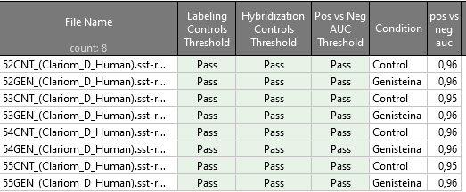
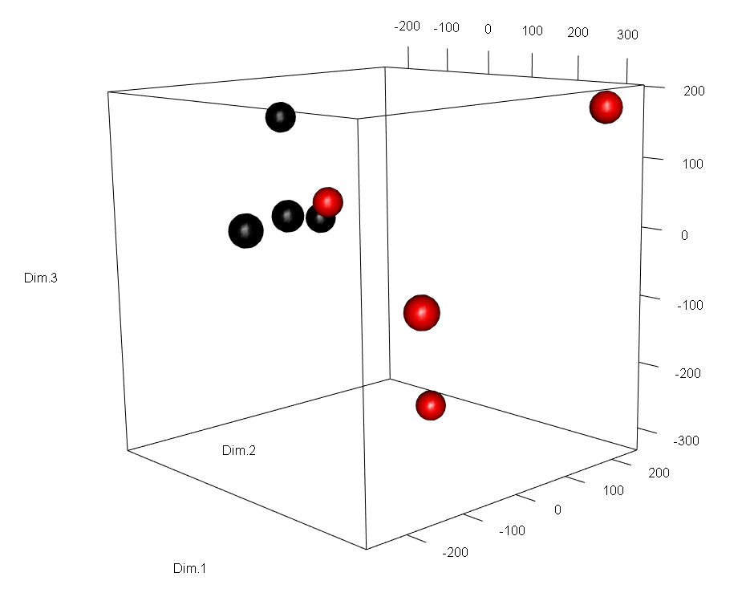
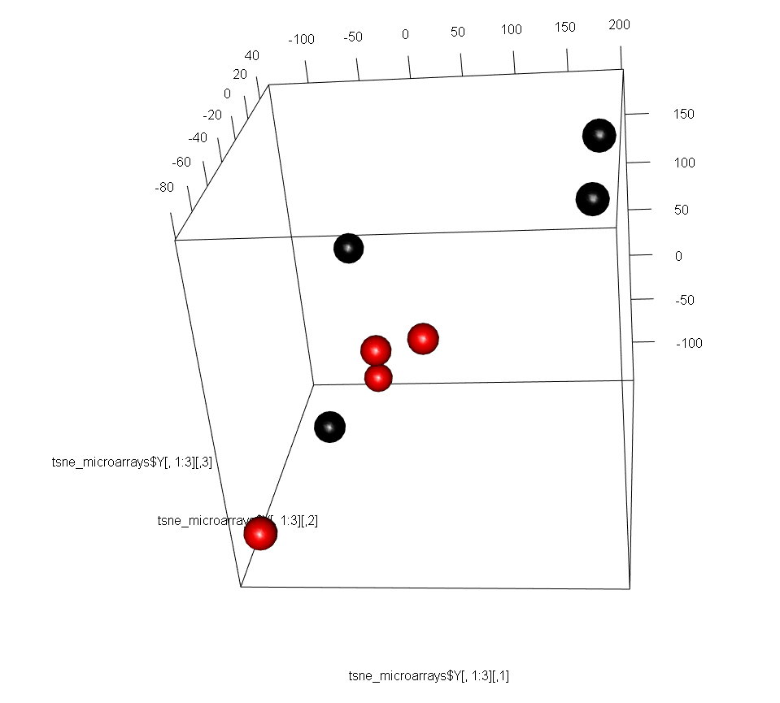
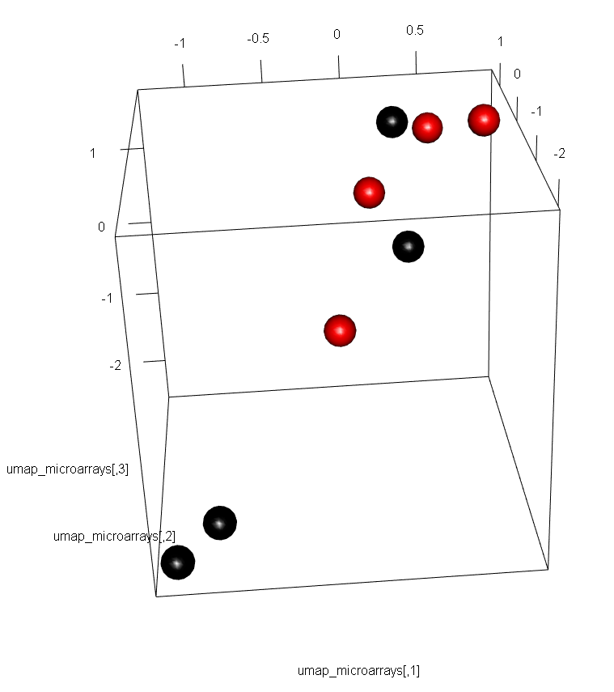

```{r configuracion inicial, include=FALSE}
# Establecemos la configuración de los chunks
knitr::opts_chunk$set(echo = T,
                      message = F,
                      warning = F,
                      tidy = F)

# Establecemos el directorio de trabajo de este informe
# knitr::opts_knit$set(root.dir = "C:/Users/Adam_/Desktop/microvesiculas - copia para trabajar/Resultados ClariomD_Human")


set.seed(1)
##################################################
#######        Encoded in UTF-8        ###########
##################################################
```

***

# Introducción

En este documento se muestra cómo analizar los archivos con extensión `.CEL` resultantes de secuenciar muestras biológicas en los microchips _Clariom D Human_ de Affymetrix. Llevaremos a cabo este análisis en R 3.6 con el paquete de Bioconductor `oligo` versión 1.50.0. La versión de Biocondcutor empleada es la 3.10.


<br>

***

# Carga de datos y librerías

Primero debemos instalar `oligo`. Téngase en cuenta que en R 3.6 se instala la versión 1.50.0 de `oligo`, el cual depende de los paquetes `ff` versión 2.2.0 y `RSQLite` versión 2.1.4. Instalar versiones posteriores ocasionará fallos en la carga de `oligo` y en los análisis posteriores:

```{r instalacion oligo y dependencias, eval = F}
# Instalación oligo en R 3.6:
BiocManager::install("oligo")

# Paquete ff versión 2.2.0: (en el portatil la 2.2.14 funciona, en el sobremesa no)
remove.packages("ff")

install.packages("https://cran.r-project.org/src/contrib/Archive/ff/ff_2.2-0.tar.gz", 
                 repos=NULL, type = "source")

installed.packages()

# Paquete RSQLite versión 2.1.4:
install.packages("https://cran.r-project.org/src/contrib/Archive/RSQLite/RSQLite_2.1.4.tar.gz",
                 repos=NULL, type = "source")
```


<br>

Comenzamos cargando `oligo` y paquetes accesorios:

```{r carga librerias}
library("oligo")
library("ggplot2")
library("dplyr") 
library("FactoMineR") # PCA
library("rgl") # 3D plots
library("Rtsne") # t-SNE
library("uwot") # UMAP
library("limma") # DEG Analysis
```

<br>

Acto seguido definimos el directorio de trabajo en la carpeta donde se encuentran los archivos de secuenciado.

```{r}
directorio_trabajo <- "../Archivos secuenciado/"
```


Listamos y cargamos los archivos de secuenciado en el objeto de tipo `HTAFeatureSet` denominado `datos_crudos_microarrays`. La carga de los archivos `.CEL` se hace mediante la función `read.celfiles`, la cual lee y carga los archivos por orden alfabético de sus nombres (_i.e._ primero carga el archivo `52CNT_(Clariom_D_Human).CEL`, luego `52GEN_(Clariom_D_Human).CEL`, luego `53CNT_(Clariom_D_Human).CEL`, ...etc):

```{r}
# Obtenemos la ruta completa de los archivos con el argumento `full.names = T`
ruta_completa_archivos_secuenciado <- list.files(path = directorio_trabajo, pattern = "*.CEL", full.names = T)

# Cargamos datos
datos_crudos_microarrays <- read.celfiles(filenames = ruta_completa_archivos_secuenciado)

# Observamos el tipo de objeto que hemos cargado
summary(datos_crudos_microarrays)

# Observamos las sondas y muestras que tenemos
dim(datos_crudos_microarrays)
```

```{r, echo = F, eval = F}
# Con el comando str() podemos ver la estructura general y bolsillos del objeto
# `datos_crudos_microarrays`, pero no lo ejecutaremos para no llenar de
# información la terminal:
str(datos_crudos_microarrays)
```


Podemos ver el nombre de los microchips con el comando `sampleNames()`.

```{r}
sampleNames(datos_crudos_microarrays)
```

Vamos a cambiar sus nombres por otros más claros:

```{r}
sampleNames(datos_crudos_microarrays) <- c("Control_1", "Genisteina_1",
                                           "Control_2", "Genisteina_2",
                                           "Control_3", "Genisteina_3",
                                           "Control_4", "Genisteina_4")
sampleNames(datos_crudos_microarrays)
```

<br>

Al cargar los archivos `.CEL` con `read.celfiles()`, se almacena en el bolsillo `datos_crudos_microarrays@assayData$exprs` la matriz de intensidades crudas de los fluoróforos Cy3 y Cy5 que hibridan con las distintas sondas de cada microarray. Esta matriz tiene tantas filas como sondas tiene el microarray, y tantas columnas como muestras hayamos secuenciado. Las funciones `exprs()` e `intensity()` del paquete `oligo` simplifican el acceso a la misma (ambas funciones devuelven exactamente el mismo _output_).

* Las filas corresponden a cada sonda individual del microarray, identificada por un nº que va desde el 1 hasta el nº máximo de sondas presentes en el mismo (en el caso de los microarrays _Clariom D Human_, estos contienen un máximo de 6.892.960 sondas).

* Las columnas son las muestras, en nuestro caso `Control_1`, `Genisteina_1`, `Control_2`... etc

```{r}
# Obtenemos la matriz de intensidades cruda
intensidades <- oligo::exprs(datos_crudos_microarrays)

# Identificamos el nº de sondas presentes en cada microchip
dim(intensidades)[1]
```


<br>

De acuerdo a la documentación de [Affymetrix](https://www.affymetrix.com/support/help/exon_glossary/index.jsp#clusteroverview), las sondas de los microarrays de tipo Clariom D Human (Gene Arrays) están agrupadas en _transcription clusters_ en vez de _probesets_.

Con el comando `probeNames()` obtenemos los _transcription clusters_ a los que pertenecen las sondas de nuestro microchip, de manera que la primera sonda del microarray pertenece al _transcription cluster_ TC1300007722.hg.1: 

```{r}
# Obtenemos y mostramos los transcription clusters a los que pertenece cada sonda
transcription_clusters <- probeNames(datos_crudos_microarrays)
head(transcription_clusters)

# Cada microarray de tipo Clariom D Human contiene 1.220.891 transcription
# clusters
length(transcription_clusters)

# Obtenemos las sondas que pertenecen al transcription cluster TC1300007722.hg.1
which(transcription_clusters == "TC1300007722.hg.1")
```

<br>

Si tenemos en cuenta la página web de ThermoFisher, podemos usar el centro de análisis NetAffx para obtener más información sobre dichos clusters. Por ejemplo, si nos fijamos en el segundo _transcription cluster_, [TC0300011139.hg.1](https://www.affymetrix.com/analysis/netaffx/exon/hta_transcript.affx?pk=778:TC0300011139.hg.1), vemos que las sondas de este cluster detectan la presencia/ausencia de expresión del pseudogen RNA5SP132 (identificador [Ensembl:ENSG00000201595](http://www.ensembl.org/Homo_sapiens/Gene/Summary?g=ENSG00000201595;r=3:51694465-51694582;t=ENST00000364725)). 


```{r, echo = F, eval = F}
which(transcription_clusters == "TC1300007722.hg.1") # Devuelve 6 de 6 sondas

which(transcription_clusters == "TC0300011139.hg.1") # Devuelve 10 de 12 sondas

which(transcription_clusters == "TC1600006939.hg.1") # Devuelve 6 de 8 sondas

which(transcription_clusters == "TC0100018028.hg.1") # Devuelve 10 de 12 sondas

which(transcription_clusters == "TC0500010071.hg.1") # Devuelve 10 de 12 sondas

which(transcription_clusters == "TC1900010290.hg.1") # Devuelve 10 de 16 sondas
```


<br>

Además, el paquete `Biobase` incluye también numerosas funciones que se pueden ejecutar sobre los objetos de tipo `HTAFeatureSet` para obtener informacion contenida en el mismo, tales como abstracts, anotaciones, ...etc.

```{r}
# Anotación usada para nuestro objeto `HTAFeatureSet`
Biobase::annotation(datos_crudos_microarrays)

# Acceder a los datos del experimento del objeto `HTAFeatureSet` (en nuestro
# caso no está anotado)
Biobase::experimentData(datos_crudos_microarrays)
```


<br>

En relación a lo dicho en el párrafo anterior, las gráficas que generemos a lo largo del protocolo de análisis pueden usar información ubicada en el bolsillo `datos_crudos_microarrays@phenoData@data`, por lo que podemos añadir metadatos de interés con el comando `pData()` de `Biobase` tal que así:

```{r}
# Renombramos la columna "index" a "muestra"
colnames(pData(datos_crudos_microarrays)) <- "muestra"

# Añadimos el factor "Condición" a los metadatos de nuestro estudio
pData(datos_crudos_microarrays)$condicion <- as.factor(rep(c("Control", "Genisteina"), times = 4))

# Visualizamos los metadatos
pData(datos_crudos_microarrays)
```

<br>

***


# Métricas de calidad

## Efecto lote

Para analizar el efecto lote, podemos usar las fechas en las que se secuenciaron los microarrays. El comando `get.celfile.dates()` del paquete `affyio` devuelve la fecha de dicho proceso.

```{r}
affyio::get.celfile.dates(ruta_completa_archivos_secuenciado)
```
Vemos que los microarrays se secuenciaron el mismo día. Adicionalmente, el programa `GeneChip Command Console 6.0` de ThermoFisher (compañía propietaria de Affymetrix) aportó la hora del secuenciado, el cual duró 6 horas en total (11AM-5PM).

En vista de que el secuenciado se realizó en un sólo lote (el mismo día y en horas consecutivas), concluimos que la probabilidad de observar varianza debida al ruido técnico del efecto lote es mínima.


<br>

## Análisis QC

El programa `TAC 4.0.2`, propiedad también de ThermoFisher, muestra un resumen muy claro de las métricas de calidad de los microarrays.



Según la documentación del programa, un valor de `pos vs neg auc` > 0.7 es un buen primer cribado de calidad. Además de presentar un AUC > 0.7, el resto de controles han salido bien, por lo que podemos confiar en la calidad del secuenciado de los presentes microarrays.


En R, el paquete `oligo` parece no poder sacar dichas métricas en microarrays de tipo _Clariom_, puesto que al ser nuevos, no llevan asociados archivos `.CDF`. Quizás `limma` o `DESeq2` puedan tratar dichos microchips.


<br>

***

# Preprocesado de los microarrays: RMA


Antes de analizar los microarrays, necesitamos preprocesar las señales de las sondas para corregir el ruido técnico (problema común en los microarrays) y agrupar la información de las sondas que mapeen para un mismo gen (_summarization_).

Para preprocesar y normalizar datos de microarrays, se suelen emplear el algoritmo `RMA` o derivados (_i.e._ `GCRMA` o `SST-RMA`). En nuestro caso vamos a usar el algoritmo `RMA`, implementado en `oligo`. Este algoritmo consta de 3 pasos:

* __Background subtraction__. De acuerdo a la [documentación](http://bioconductor.org/packages/release/bioc/vignettes/oligo/inst/doc/oug.pdf) de `oligo`, el método de _background substraction_ implementado en RMA trata las sondas PM (_Perfect Match_, más informacion en [Flight _et al._, 2012](http://rmflight.github.io/affyMM/)) como una convolución de ruido y señal verdadera.

* __Quantile normalization__. Paso necesario para dotar de igual valor a los genes estudiados, independientemente de su nivel de expresión constitutivo (este paso evita, por ejemplo, que genes expresados de manera constitutiva pero poco interesantes para el estudio estén sobrerrepresentados en análisis posteriores con respecto de genes más relevantes, pero de menor expresión basal como son los genes codificantes de factores de transcripcion). El método de normalizado implementado en `oligo` es `quantile`.

* __Summarization__. Pasamos de analizar intensidades de sondas a niveles de expresión de genes. `oligo` realiza este paso mediante el método `medianpolish`.


Para más información sobre la implementación de estos pasos en oligo, por favor consulte la documentación de los comandos `rma`, `backgroundCorrectionMethods()` y sucedáneos.


<br>

En `oligo`, el comando `rma` nos devuelve un objeto de tipo `ExpressionSet` (similar al objeto `datos_crudos_microarrays`) con los datos preprocesados en el bolsillo `eSet_normalizado@assayData$exprs`. Procedemos al RMA:

```{r}
eSet_normalizado <- oligo::rma(object = datos_crudos_microarrays,
                                 background = T, normalize = T)

head(eSet_normalizado@assayData$exprs)[,1:4]
```

<br>

## Comprobación del normalizado: Boxplots

Podemos comparar los datos antes y después del normalizado y control de ruido técnico. Observamos que las intensidades medianas y los cuartiles 25-75 son idénticos entre todos los microarrays tras el normalizado, cosa que no era cierta en los datos crudos:

```{r}
par(mfcol = c(1,2))

boxplot(datos_crudos_microarrays, "all", 
        main = "Antes", col = rainbow(8), 
        ylab = "intensidad sondas (log2)")

boxplot(eSet_normalizado, main = "Después",
        col = rainbow(8), ylab = "intensidad sondas (log2)")
```


<br>

***

# Análisis DEG

De acuerdo a [McDermaid _et al._(2019)](https://www.ncbi.nlm.nih.gov/pmc/articles/PMC6954399/), podría usar para DGE análisis edgeR, Cutdiff/Cutdiff2, limma, DESeq2.. etc

<br>


## Separación de las muestras: PCA, t-SNE y UMAP

Con los datos ya normalizados, podemos graficar los microarrays estudiados en un espacio de dimensionalidad reducida. La separación de los microarrays en dicho espacio nos dará una idea general de si existen genes diferencialmente expresados entre las condiciones estudiadas.

Para el PCA, podemos usar las utilidades del paquete `FactoMineR` tal que así:

```{r}
# Creamos un dataframe de intensidades procesable por el PCA de 
# dimensiones instancias x variables
intensidades_normalizadas <- t(exprs(eSet_normalizado))
intensidades_normalizadas_df <- as.data.frame(intensidades_normalizadas)

# Añadimos al dataframe el factor "condicion"
intensidades_normalizadas_df$condicion <- pData(eSet_normalizado)$condicion

# Computamos las 3 primeras componentes principales
pca_microarrays <- PCA(intensidades_normalizadas_df, graph = F, 
                       axes = c(1:3), quali.sup = 138746)

# Graficamos las 2 primeras componentes principales
plot.PCA(pca_microarrays, choix = "ind", habillage = 138746)

# library(FactoInvestigate)
# FactoInvestigate::Investigate(pca_microarrays)
```

```{r, eval = F}
# Para otros análisis
saveRDS(intensidades_normalizadas_df, file = "intensidades_normalizadas_df.rds")
```


```{r, eval = F}
# Graficamos las 3 primeras componentes principales
plot3d(pca_microarrays$ind$coord[,1:3], type = "s", 
       col = c(rep(c("black", "red"), times = 4)))
```





<br>

<br>

y para el t-SNE:

```{r}
normalizado_tsne <- normalize_input(intensidades_normalizadas)
tsne_microarrays <- Rtsne(normalizado_tsne, dims = 3, perplexity = 2)

# Leyenda: Control negro, Genisteína rojo
plot(tsne_microarrays$Y, col = c("black", "red"))
```

```{r, eval = F}
plot3d(tsne_microarrays$Y[,1:3], type = "s", 
       col = c(rep(c("black", "red"), times = 4)))
```



<br>

<br>

y el UMAP:

```{r}

umap_microarrays <- uwot::umap(intensidades_normalizadas, n_neighbors = 3, 
                               n_components = 3)

# Leyenda: Control negro, Genisteína rojo
plot(umap_microarrays, col = c("black", "red"))
```

```{r, eval = F}
# Graficamos el UMAP en 3D
plot3d(umap_microarrays, type = "s", 
       col = c(rep(c("black", "red"), times = 4)))

```




<br>


En resumen, sólo el PCA 3D es informativo de la posible distribución de las muestras. El t-SNE y el UMAP en 3D no son concluyentes (los datos parecen mezclarse).


<br>

## Análisis cualitativo: MA Plots

Para visualizar si hay genes diferencialmente expresados, podemos emplear el comando `MAplot` del paquete `oligo`. Los gráficos MA muestran en el eje X la intensidad media de una sonda dada a lo largo de los microarrays estudiados, y en el eje Y se observa el log2(fold change) o logaritmo en base dos del ratio de sobre/infraexpresión del gen al que mapea dicha sonda. 

Los genes diferencialmente expresados se encontrarán lejos de la nube de puntos (log2(FC) > |1|), mientras que los genes que no varíen entre condiciones presentarán valores de log2(FC) cercanos a 0. No obstante, el MA plot no devuelve p-valores, por lo que para asegurarnos de que los resultados son significativos, deberíamos recurrir a un Volcano plot, que combina el log2(FC) y los p-valores de los genes estudiados.

```{r}
par(mfrow=c(2,2))

oligo::MAplot(eSet_normalizado, refSamples = c(1,3,5,7), which = c(2,4,6,8), main = "vs grupo Control")
```


<br>


## `limma`

Procedemos a detectar los genes diferencialmente expresados mediante las utilidades del paquete `limma`, ya que `oligo` carece de las funciones necesarias para ello. `limma` usa como _input_ el objeto que devuelve el comando `rma()`.

NOTA: usé t-test no pareado, pero si las células troncales provienen del mismo individuo (no son sets independientes), entonces tendré que usar un t-test para datos pareados.

Tras hablar con gambini, reuslta que son datos pareados. debo corregir eso-.


`limma` contiene funciones para hacer t-tests o ANOVAs para identificar DEGs en microarrays. Estas funciones pueden ser usadas en datos provenientes de cualquier tipo de microarray y funcionan incluso para microarrays con diseños complejos o múltiples muestras. La idea principal es ajustar un modelo lineal a los datos de expresión de cada gen. Los datos de expresión pueden ser log-ratios o log-intensidades. Los métodos empleados obtienen información sobre todos los genes para hacer que los análisis sean estables incluso en experimentos con un bajo tamaño muestral.


### 2 grupos de datos (no pareados)

Antes de nada tenemos que indicar a `limma` mediante el hueco `phenoData` qué muestras son réplicas y cuáles pertenecen a diferentes grupos. Podemos ver que ya hemos hecho eso en pasos anteriores:

```{r}
pData(eSet_normalizado)
```


Ahora tenemos que indicar a `limma` qué muestras pertenecen a qué grupo:

```{r}
grupo = pData(eSet_normalizado)$condicion 
```


Ahora tenemos que crear una __matriz de diseño__, o sea una matriz de valores de la variable que agrupa los datos. El ANOVA (y los GLMs) necesita dicha matriz para saber qué muestras pertenecen a qué grupo. Puesto que `limma` usa un t-test o un ANOVA, necesita dicha matriz de diseño. puedes crearla con el método `model.matrix()`. Esta función toma como argumento un modelo de fórmula (_model formula_). La virgulilla (~) especifica el lado derecho de la fórmula. Si usas como fórmula ~0, `limma` calculará sólo la expresión génica media de cada grupo.

```{r}
# Creamos el diseño del t-test no pareado
# diseno = model.matrix(~ 0 + eSet_normalizado$condicion)
diseno = model.matrix(~ 0 + grupo)
colnames(diseno) = c("Control","Genisteina")
```


En esencia, `limma` va a comparar, para cada gen, su expresión media en las muestras control y su expresión media en las muestras tratadas. Lo primero, `limma` debe calcular la expresión media de cada grupo usando el comando `lmFit()`. Este comando ajustará un modelo lineal (definido previamente con el comando `model.matrix`) a los datos para calcular la expresión génica media en las muestras control y las muestras tratadas:

```{r}
# Generamos el modelo lineal
data.fit = lmFit(t(intensidades_normalizadas), diseno)
```


Podemos ver los resultados del modelo lineal en el bolsillo `$coefficients`:

```{r}
data.fit$coefficients[5000:5010,]
```


Ahora debes indicarle al paquete qué grupos quieres comparar. Para ello debes definir una __matriz de contrastes__ en la cual se especifiquen las comparaciones a realizar mediante el comando `makeContrasts()`. Usando los nombres de las columnas de la matriz de diseño, puedes especificar el grupo control respecto al cual quieres comparar el grupo de interés (tratado con genisteína).

```{r}
contrast.matrix = makeContrasts(Genisteina-Control, levels = diseno)
data.fit.con = contrasts.fit(data.fit, contrast.matrix)
```


Ahora `limma` está listo para realizar los tests estadísticos para comparar los grupos. Ya que compararemos dos grupos, usaremos un t-test.

`limma` no realiza un t-test corriente, sino que calcula un t-test moderado con menor desviación estándar para cada gen. Un método bayesiano empírico se usa para reducir la desviación estándar de cada gen para hacerlos converger hasta un valor común a todos los genes. Esto se hace para minimizar la influencia de valores extremos (tanto grandes como pequeños) de desviaciones estándar en el t-test. Dado que nuestro nº de muestras es pequeño, las desviaciones estándar no serán fiables (lo que hace que no sea recomendable usar un t-test corriente y moliente). Empero, aunque el n muestral es pequeño, el nº total de comparaciones es enorme, por lo que la información se combina entre todos los genes (la desviación estándar de todo el genoma se reduce) para mejorar el rendimiento.

El t-test moderado se realiza con el comando `eBayes()`:

```{r}
data.fit.eb = eBayes(data.fit.con)
```


El comando `eBayes()` devuelve un dataframe con múltiples huecos. Para ver un resumen de todos sus huecos, usa el comando `names()`: 

```{r}
names(data.fit.eb)
```


Puedes obtener los log<sub>2</sub> fold changes de la expresión de cada gen a través del hueco `$coefficients` (los coeficientes son la diferencia entre la log expresión media en las muestras tratadas con genisteína y la log expresión media de las muestras control):

```{r}
# Log2FC de genes:
data.fit.eb$coefficients[11600:11610,]
```


Puedes encontrar los valores del estadístico t y el p-valor de cada gen en sus respectivos huecos:

```{r}
data.fit.eb$p.value[11600:11610,]
data.fit.eb$t[11600:11610,]
```


El output de la función `eBayes()` contiene huecos para los p-valores y los estadísticos F (el estadístico F es un estadístico empleado en los ANOVAs). El t-test es un caso especial de ANOVA para comparaciones sencillas. En el caso del t-test, en el que realizas una comparación, el estadístico F es igual al estadístico t al cuadrado. En el ANOVA (_i.e._ comparaciones múltiples), eso no se cumple:

```{r}
data.fit.eb$t[1:10,]^2
data.fit.eb$F[1:10]
```


Tras realizar el t-test moderado, se grafican los resultados en un Volcano plot. El volcano plot muestra en el eje X el log2FC entre dos grupos (_i.e._ impacto biológico del cambio), y el eje Y mide el p-valor del cambio (_i.e._ la evidencia estadística de los resultados).

```{r}
# Genes en los cuadrantes superiores derecho e izquierdo son candidatos de genes
# diferencialmente expresados y estadísticamente significativos
volcanoplot(data.fit.eb, highlight = 0); abline(h = 1.301, v = c(-1,1))
```


### 2 grupos de datos pareados

```{r}
# Creamos el diseño del t-test pareado (este es el bueno)


# As an example we will compare 2 groups of 4 patients before and after treatment (no genistein and after genistein):

# Treatment is the grouping variable dividing the data set into two groups:
# control and genistein-treated. To tell limma that your data is paired you just
# create a second grouping variable called patient:
pData(eSet_normalizado)
pData(eSet_normalizado)[,3] = c("muestra1", "muestra1", "muestra2", "muestra2", "muestra3", "muestra3", "muestra4", "muestra4")
colnames(eSet_normalizado@phenoData@data)[3] = "pareados"

# Of course, now you need to factorize both grouping variables: 

groupsP = pData(eSet_normalizado)$pareados 
groupsT = pData(eSet_normalizado)$condicion
fp = factor(groupsP,levels=c("muestra1","muestra2","muestra3","muestra4"))
ft = factor(groupsT,levels=c("Control","Genisteina"))

# Then you need to create a design matrix, a matrix of values of the grouping
# variable. ANOVA needs such a matrix to know which samples belong to which
# group. Since limma performs an ANOVA, it needs such a design matrix. You can
# create it using the model.matrix() method.

# The argument of the model.matrix method is a model formula. The tilde (~) in
# the argument specifies the right hand side of the model equation. The plus (+)
# is used to combine factors.

# Creamos el diseño del t-test pareado
paired.design = model.matrix(~ fp + ft)
colnames(paired.design)=c("Intercept","muestra2vsmuestra1","muestra3versusmuestra1","muestra4versusmuestra1", "GenisteinavsControl")


# Generamos modelo lineal
data.fit = lmFit(t(intensidades_normalizadas), paired.design)
data.fit$coefficients[1:20,]


# Lmfit() will fit a linear model to the data. It will create a data frame called data.fit. The interesting data is in the coefficients table which contains 4 columns:
# 
#     the first column contains the intercept of the linear fit, in most cases it has no implicit meaning.
#     the second column compares patient 1 and patient 2: it is the difference between the average expression of patient 2 over the two treatments and the average expression level of patient 1 over the two treatments.
#     the third column compares patient 1 and patient 3 in the same way.
#     the fourth column compares before and after treatment: it calculates the average difference in expression level between after and before treatment. This is the measure that is used in the paired t-test and compared to 0. So these are the values we are interested in. The more this measure differs from 0 the more likely it is that the treatment has an effect.
# 
# Performing a moderated paired t-test is now done using eBayes(). 

data.fit.eb = eBayes(data.fit)
data.fit.eb$p.value[1:20,]


# Log2FC de genes:
data.fit.eb$coefficients[11600:11610,]

# p-valores de los t-tests moderados por eBayes
data.fit.eb$p.value[11600:11610,]


# volcanoplot(data.fit.eb, highlight = 0) ; abline(h = 1.301, v = c(-1,1))
```


```{r}
tab = topTable(data.fit.eb ,coef = 1 ,number = 138745, adjust.method ="BH", sort.by = "p")
head(tab)


# Elegimos los genes que caen en las regiones del volcano plot de interés
genes_diferencialmente_expresados <- which(tab$P.Value <= 0.05 & abs(tab$logFC) >= 1)

# Encontramos 204 candidatos. Recordemos que el 60% de ellos puede ser ruido,
# otros serán sondas de QC (HTA-pos/neg-3371052_st...)
length(genes_diferencialmente_expresados)

lista_DGE_limma <- rownames(tab[genes_diferencialmente_expresados,])

# lista_DGE_limma <- as.vector(lista_DGE_limma)
write.table(x = lista_DGE_limma, file = "lista_DGE_limma.txt", quote = F, row.names = F, col.names = F)
```


<br>

NOTA: limma incluye el comando `vennDiagram()`

https://www.datanovia.com/en/blog/venn-diagram-with-r-or-rstudio-a-million-ways/
paquetes ggvenn o ggVennDiagram


```{r ejemplo vennDiagram, eval = F}
DEresults = decideTests(data.fit.eb,method='global',adjust.method="BH",p.value=0.05,lfc=1)
DEresults[1:10,]

vennDiagram(DEresults)

```


<br>

***

# Bibliografía

* https://wiki.bits.vib.be/index.php/Analyze_your_own_microarray_data_in_R/Bioconductor

* https://www.thermofisher.com/es/es/home/life-science/microarray-analysis/microarray-data-analysis.html

* https://www.affymetrix.com/support/help/exon_glossary/index.jsp#clusteroverview

* https://www.affymetrix.com/analysis/netaffx

* http://bioconductor.org/packages/release/bioc/vignettes/oligo/inst/doc/oug.pdf

* R. M. Flight, A. M. Eteleeb and E. C. Rouchka, "Affymetrix® Mismatch (MM) Probes: Useful after All," 2012 ASE/IEEE International Conference on BioMedical Computing (BioMedCom), 2012, pp. 6-13, doi: 10.1109/BioMedCom.2012.8.


***

<br>


# sessionInfo()

```{r, echo = F}
sessionInfo()
```
